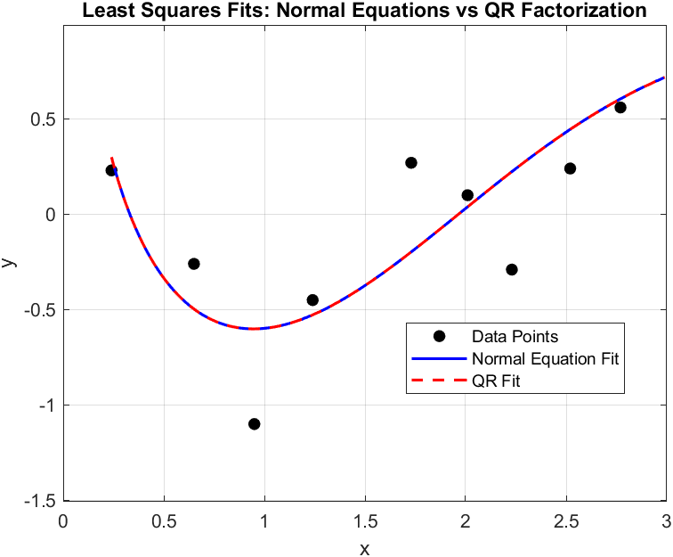

# Least Squares Regression and Gauss-Newton Method (MATLAB)

**Quarter:** Spring 2025  

In this project we fit noisy data to models using two approaches. The first fits 10 data points to the model $y = a\ln(x) + b\cos(x) + ce^x$, comparing normal equations (a standard linear algebra approach to overdetermined systems) against a QR factorization built from scratch using Householder reflectors, a numerically stable orthogonalization technique. The second uses the Gauss-Newton method, an iterative algorithm that repeatedly linearizes a nonlinear system to converge to a best-fit solution, applied to fitting a power law model to height and weight data.

## Contents

| File                        | Description                                                                                                                                                                                                                          |
| --------------------------- | ------------------------------------------------------------------------------------------------------------------------------------------------------------------------------------------------------------------------------------ |
| `least_squares_regression.m` | Fits data to $y = a\ln(x) + b\cos(x) + ce^x$ using two methods: normal equations (Part A) and a hand-built QR factorization via Householder reflectors (Part B). Reports coefficients, SE, and RMSE for both and plots both fits.  |
| `gauss_newton.m`             | Implements the Gauss-Newton method to fit a power law model $w = c_1 h^{c_2}$ to height and weight data. Iterates until convergence and reports the parameter vector at each step.                                                  |

## Results

### Problem 1: Least Squares Regression

**Part A: Normal equations**

Solution [a; b; c]:
```
a = -1.0410322169
b = -1.2613187847
c =  0.0307348257

Squared Error (SE): 0.92557
Root Mean Squared Error (RMSE): 0.30423
```

**Part B: Reduced QR factorization (Householder reflectors)**

Both methods produce the same coefficients and error, confirming correctness:
```
a = -1.0410322169
b = -1.2613187847
c =  0.0307348257

Squared Error (SE): 0.92557
Root Mean Squared Error (RMSE): 0.30423
```



---

### Problem 2: Gauss-Newton Method

Fitting the power law model $w = c_1 h^{c_2}$ to height/weight data, starting from initial guess $[10,\ 2]^\top$:

```
Iter    c1              c2              ||x(k) - x(k-1)||
   1    15.889830539    2.923994287    5.961867930
   2    15.819855926    2.572200702    0.358685340
   3    15.881616259    2.534528324    0.072343256
   4    15.885289451    2.533612307    0.003785688
   5    15.885372302    2.533593657    0.000084924
   6    15.885373986    2.533593277    0.000001726
   7    15.885374020    2.533593269    0.000000035
   8    15.885374021    2.533593269    0.000000001

Final parameter vector
c1 = 15.885374021
c2 = 2.533593269
```

Converged in 8 iterations.

## Running

Each script can be run directly from MATLAB.

```matlab
>> least_squares_regression
>> gauss_newton
```
